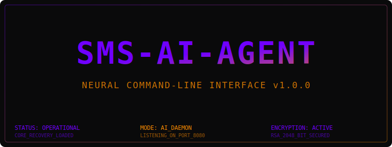

# SMS AI Agent

<div align="center">
  
</div>

> **IMPORTANT: Termux:API Setup Required**
> For this agent to read or send SMS, you **MUST** install the Termux:API components:
> 1. **Download App**: Install the **Termux:API Android App** from [F-Droid](https://f-droid.org/en/packages/com.termux.api/) or the [Google Play Store](https://play.google.com/store/apps/details?id=com.termux.api).
> 2. **Install Package**: Run `pkg install termux-api` inside your Termux terminal.
> 3. **Grant Permissions**: Go to Android Settings → Apps → Termux:API → Permissions and enable **SMS, Phone, and Storage**.
> 4. **Disable Battery Optimization**: Ensure battery optimization is disabled for both Termux and Termux:API to prevent the background service from being killed.

---

**A production-ready, Termux-based SMS auto-responder with AI capabilities**

[](https://opensource.org/licenses/MIT)
[](https://www.python.org/downloads/)
[](https://termux.com/)

---

## 📱 Overview

SMS AI Agent is a modular, secure SMS auto-responder for Android devices running through Termux. It operates in two modes:

1. **Rule-based Template Responder** - Pattern matching with customizable response templates
2. **AI-powered Responder** - Uses LLMs (OpenRouter/Ollama) for contextual responses

### Key Features

- 🔒 **Security First** - API keys in .env, no hardcoded secrets, guardrail system
- 🤖 **LLM Integration** - OpenRouter (100+ models) and Ollama (local LLM) support
- 📝 **Rules Engine** - Regex, keyword, and pattern matching with priorities
- ⚡ **Rate Limiting** - Per-recipient and global rate limits to prevent abuse
- 🛡️ **Guardrails** - PII detection, content filtering, SMS length constraints
- 🖥️ **Dual UI** - Web UI (FastAPI) and Terminal UI (Textual)
- 💾 **SQLite Storage** - Message history, logs, and settings persistence
- 🔄 **Auto-start** - Termux:Boot integration for device startup
- 👤 **Contact Personalization** - Set specific AI instructions, names, and relations for individual phone numbers.

### 👤 Contact Personalization & Per-Number AI

You can now customize how the AI interacts with specific people in your life. By setting contact-specific metadata, the AI gains awareness of who it is talking to and how it should behave.

- **Name & Relation**: Tell the AI who the person is (e.g., "John - Brother").
- **Custom Prompts**: Provide unique instructions per number (e.g., "Be very respectful to my Boss" or "Use lots of emojis with my Best Friend").
- **Smart Context**: These details are injected directly into the system prompt for highly personalized responses.
- **Robust Tracking**: The system tracks `responded` status for every message, ensuring it never replies twice to the same text or gets stuck in a self-reply loop.

### ⚠️ Important: What This App Does

**This app works with SMS messages only!**

It can:
- ✅ Read incoming SMS messages
- ✅ Generate AI-powered replies using OpenRouter/Ollama
- ✅ Send SMS responses automatically
- ✅ Work with rule-based responses

It cannot:
- ❌ Read messages from WhatsApp, Instagram, Messenger, Telegram, etc.
- ❌ Read notification content from other apps
- ❌ Work with messaging apps that don't use SMS

**Why?** SMS is a system-level feature that Termux can access via Termux:API. Other messaging apps (WhatsApp, Instagram, etc.) use their own encrypted protocols and require special Android permissions (Accessibility Services or Notification Listener) to access.

To extend to other apps, you would need a separate Android app that acts as a notification listener or uses Accessibility Services to read messages and forward them to this SMS AI Agent.

---

## 📋 Requirements

### Android Device
- Android 7.0+ (API 24+)
- Termux app installed
- Termux:API app installed

### Termux Packages
```bash
pkg update
pkg install python python-pip termux-api git
```

### LLM Provider (Choose One)
- **OpenRouter**: API key from [openrouter.ai](https://openrouter.ai/keys)
- **Ollama**: Local installation at [ollama.ai](https://ollama.ai)

### Using Free Models (Recommended for Zero Cost)
The app is pre-configured to use `openrouter/free` which automatically selects from free models. This means:
- **No cost** - Completely free AI responses
- **Auto-selection** - Randomly picks from available free models each request
- **Always free** - No credit card required

To use specific free models instead, you can set:
- `openrouter/free` - Random free model (default)
- `meta-llama/llama-3.3-70b-instruct:free` - Llama model
- `google/gemma-2-9b-it:free` - Gemma model
- `mistralai/mistral-7b-instruct:free` - Mistral model

---

## 🚀 Quick Start

### 1. Install SMS AI Agent

```bash
# Clone or download
git clone https://github.com/your-username/sms-ai-agent.git
cd sms-ai-agent

# Run installer
chmod +x install.sh
./install.sh --first-run
```

### 2. Configure API Key

```bash
# Edit configuration
nano ~/.config/sms-ai-agent/.env

# Add your OpenRouter API key
OPENROUTER_API_KEY=sk-or-your-key-here
```

### 3. Start the Agent

```bash
# Web UI (recommended)
python main.py --web

# Terminal UI
python main.py --tui

# Background daemon
python main.py --daemon
```

### 4. Grant Permissions

When prompted, grant SMS permissions to Termux:
1. Go to Settings → Apps → Termux → Permissions
2. Enable SMS permission
3. Enable Storage permission (for configuration files)

---

## 📖 Documentation

### Configuration

Main configuration file: `~/.config/sms-ai-agent/config.yaml`

```yaml
llm:
  provider: "openrouter"
  model: "openrouter/free"  # Uses random free model - zero cost!
  temperature: 0.7
  max_tokens: 150

sms:
  auto_reply_enabled: true
  ai_mode_enabled: true
  max_response_length: 300

rate_limit:
  max_messages_per_minute: 10
  max_per_recipient_per_hour: 5
```

### Personality Customization

Edit `~/.config/sms-ai-agent/personality.md` to customize AI behavior:

```markdown
# Personality Instructions

You are a friendly SMS assistant. Your responses should be:
- Concise (under 300 characters)
- Friendly and conversational
- Helpful and informative
```

### Rules Engine

Add custom rules in the Web UI or edit `~/.config/sms-ai-agent/rules.yaml`:

```yaml
rules:
  - name: "greeting"
    patterns: ["hello", "hi", "hey"]
    match_type: "contains"
    responses:
      - "Hello! How can I help?"
      - "Hi there!"
    priority: 50
```

---

## 🏗️ Architecture

```
sms-ai-agent/
├── core/                   # Core functionality
│   ├── config.py          # Configuration management
│   ├── database.py        # SQLite operations
│   ├── exceptions.py      # Custom exceptions
│   ├── logging.py         # Logging setup
│   ├── rate_limiter.py    # Rate limiting
│   └── security.py        # Security utilities
├── llm/                    # LLM providers
│   ├── base.py            # Abstract provider
│   ├── openrouter.py      # OpenRouter integration
│   ├── ollama.py          # Ollama integration
│   └── factory.py         # Provider factory
├── rules/                  # Rules engine
│   ├── engine.py          # Pattern matching
│   └── templates.py       # Template processing
├── services/               # Core services
│   ├── sms_handler.py     # Termux SMS API
│   ├── guardrails.py      # Response safety
│   └── ai_responder.py    # AI response generation
├── ui/                     # User interfaces
│   ├── web/               # FastAPI web UI
│   │   ├── app.py
│   │   ├── routes.py
│   │   └── templates/
│   └── terminal/          # Textual TUI
│       └── app.py
├── config/                 # Configuration files
│   ├── config.yaml        # Main config
│   ├── personality.md     # AI personality
│   ├── agent.md           # Agent rules
│   └── .env.example       # Environment template
├── main.py                 # Entry point
├── install.sh              # Installation script
└── requirements.txt        # Python dependencies
```

---

## 🔧 Command Line Interface

```bash
# Show help
python main.py --help

# Start web UI
python main.py --web --port 8080

# Start terminal UI
python main.py --tui

# Run as daemon
python main.py --daemon

# Check status
python main.py --status

# Test message
python main.py --test "Hello, how are you?"

# Set API key
python main.py --api-key sk-or-your-key

# Run setup wizard
python main.py --setup
```

---

## 🔐 Security

### API Key Storage
- API keys are stored in `~/.config/sms-ai-agent/.env`
- File permissions are set to 600 (owner read/write only)
- Never commit .env files to version control

### Guardrails
The system includes multiple safety layers:

1. **Length Constraints** - Enforces 300 character SMS limit
2. **PII Detection** - Blocks phone numbers, emails, credit cards
3. **Content Filtering** - Blocks passwords, SSNs, bank info
4. **Pattern Blocking** - Custom regex patterns
5. **Fallback Responses** - Safe defaults when violations occur

### Rate Limiting
Prevents abuse with configurable limits:
- Global: 10 messages/minute
- Per-recipient: 5/hour, 20/day
- Burst protection: 3 messages/minute

### Data Privacy
- All data stored locally on device
- No external data transmission (except LLM API calls)
- Data wipe script available

---

## 📱 Termux Integration

### Auto-start on Boot

1. Install Termux:Boot from F-Droid
2. Run the installer with `--first-run` flag
3. Boot script will be created at `~/.termux/boot/`

### Home Screen Shortcuts

1. Install Termux:Widget from F-Droid
2. Shortcuts are created at `~/.termux/shortcuts/`
3. Add widgets to home screen for quick access

### SMS Permissions

For Android 10+:
```bash
# Request SMS permission
termux-sms-send -n 0000000000 "test"

# Or manually grant in settings
Settings → Apps → Termux → Permissions → SMS
```

---

## 🧪 Testing

```bash
# Run all tests
pytest tests/

# Test SMS handler
python -c "from services.sms_handler import test_sms_handler; print(test_sms_handler())"

# Test LLM connection
python main.py --test "Hello"
```

---

## 🐛 Troubleshooting

### SMS Not Working
1. Verify Termux:API is installed
2. Grant SMS permission in Android settings
3. Test with: `termux-sms-list`

### LLM Connection Failed
1. Check API key in `.env` file
2. Verify internet connection
3. Test with: `python main.py --status`

### Web UI Not Accessible
1. Check if port is available
2. Try different port: `python main.py --web --port 9000`
3. Use `0.0.0.0` for external access: `python main.py --web --host 0.0.0.0`

### Rate Limit Exceeded
- Wait for rate limit window to reset
- Adjust limits in `config.yaml`
- Check status with: `python main.py --status`

---

## 🤝 Contributing

Contributions are welcome! Please:

1. Fork the repository
2. Create a feature branch
3. Make your changes
4. Run tests
5. Submit a pull request

### Code Style
- Follow PEP 8 guidelines
- Use type hints
- Add docstrings to functions
- Keep functions under 50 lines

---

## 📄 License

This project is licensed under the MIT License - see the [LICENSE](LICENSE) file for details.

---

## 🙏 Acknowledgments

- [Termux](https://termux.com/) - Android terminal emulator
- [OpenRouter](https://openrouter.ai/) - LLM API gateway
- [Ollama](https://ollama.ai/) - Local LLM runtime
- [Textual](https://textual.textualize.io/) - Terminal UI framework
- [FastAPI](https://fastapi.tiangolo.com/) - Web framework

---

## 📞 Support

- **Issues**: [GitHub Issues](https://github.com/your-username/sms-ai-agent/issues)
- **Discussions**: [GitHub Discussions](https://github.com/your-username/sms-ai-agent/discussions)
- **Documentation**: [Wiki](https://github.com/your-username/sms-ai-agent/wiki)

---

## 📊 Compatibility

| Android Version | Status | Notes |
|----------------|--------|-------|
| Android 7-9 | ✅ Full | All features work |
| Android 10-11 | ⚠️ Partial | SMS permissions need manual grant |
| Android 12+ | ⚠️ Partial | Background restrictions may apply |

**Note**: Some Android versions require additional setup for background SMS operations.

---

**Made with ❤️ for the Termux community**
